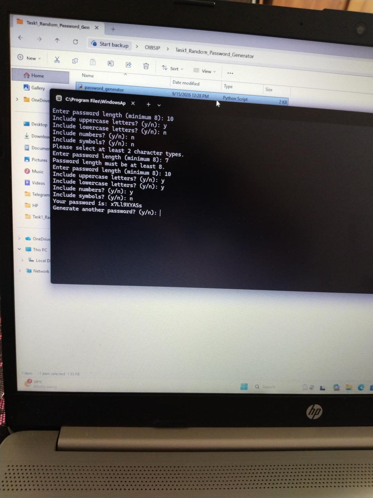
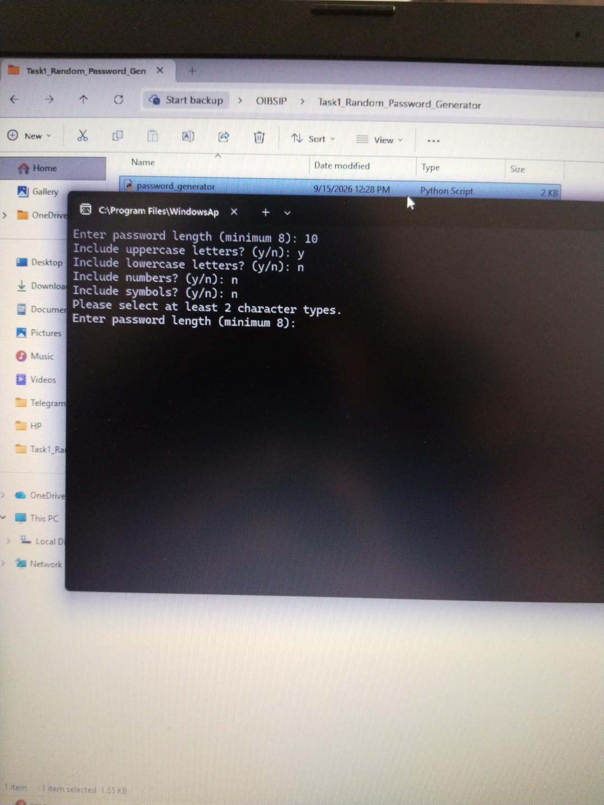
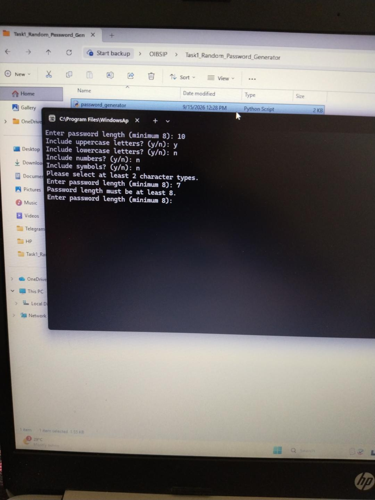

# Random Password Generator

## About the Project

This project is a Random Password Generator developed using Python.

It generates a random password based on the user's selected password length and character types.

## Features

- Requires a minimum password length of 8 characters.
- Allows uppercase letters.
- Allows lowercase letters.
- Allows numbers.
- Allows symbols.
- Requires at least 2 character types to be selected.
- Generates a random password.
- Validates invalid inputs.
- Allows the user to generate another password without restarting.

## Technologies Used

- Python
- random module
- string module

## How to Run

1. Make sure Python is installed.
2. Open the project folder in Command Prompt.
3. Run the following command:

python password_generator.py

4. Enter the required password length.
5. Select the character types using y or n.
6. The generated password will be displayed.

## Screenshot Documentation

### 1. Successful Password Generation

The program successfully generates a password when a valid length and at least two character types are selected.

### 2. Character Type Validation

The program displays an error message when fewer than two character types are selected.

### 3. Minimum Length Validation

The program displays an error message when the password length is less than 8.

## Project Structure

OIBSIP/
└── Python-Task1-RandomPasswordGenerator/
    ├── password_generator.py
    ├── README.md
    └── screenshots/

## Internship Task

Oasis Infobyte - Python Programming Internship

Task 1: Random Password Generator

## Author

Nanda K